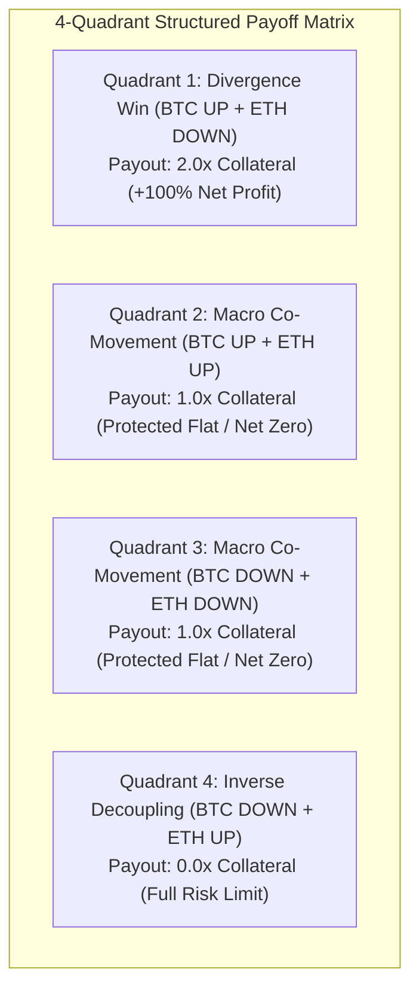
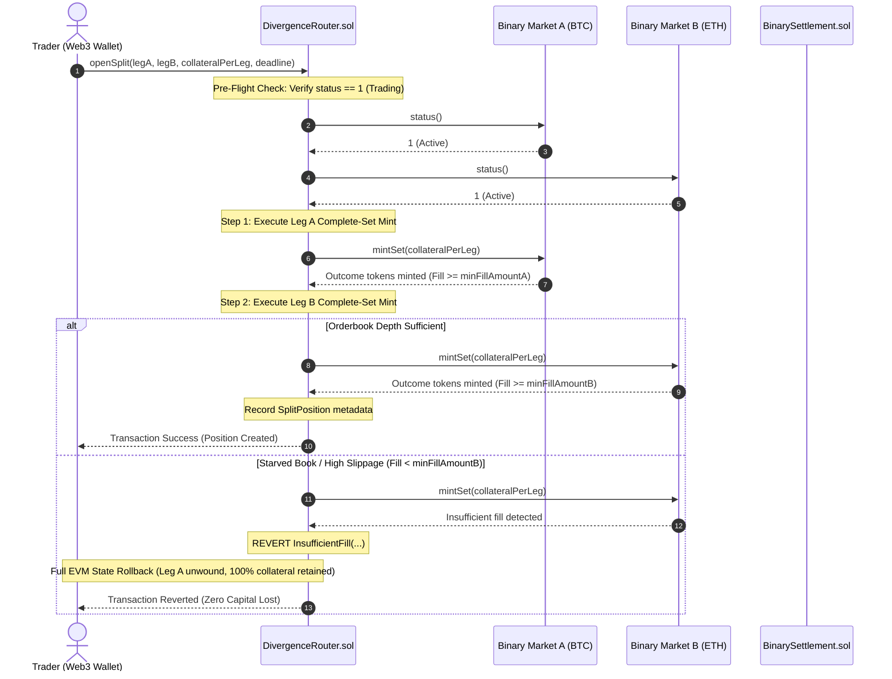
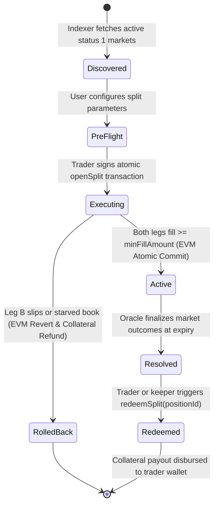

<p align="center">
  
</p>

<h1 align="center">D I V E R G E N C E &nbsp; R O U T E R</h1>

<p align="center">
  <b>Institutional-Grade 1-Click Atomic Execution Engine for Structured Multi-Leg Event Contracts on Somnia DreamDEX</b>
</p>

<p align="center">
  <a href="https://shannon-explorer.somnia.network"></a>
  <a href="https://docs.dreamdex.io"></a>
  <a href="https://soliditylang.org"></a>
  <a href="https://opensource.org/licenses/MIT"></a>
  <a href="https://nextjs.org"></a>
</p>

---

## 🎯 Executive Summary

Every current event-contract implementation on prediction markets treats contracts in **1D isolation**: a single asset, a single expiry window, and a binary $\{0, 1\}$ coin-flip.

**Divergence Router** transforms these isolated binary primitives into **institutional-grade structured positions**. By simultaneously bridging the two native orthogonal dimensions DreamDEX provides—**Asset** (BTC, ETH) and **Cadence Window** (15m, 1h, 4h)—Divergence Router allows traders to execute:

1. **Cross-Asset Divergence Splits**: Long BTC-1h UP + Long ETH-1h DOWN (monetizing decoupling events without taking net directional market beta).
2. **Calendar Term-Structure Inversions**: Long BTC-15m UP + Long BTC-1h DOWN (expressing a short-term momentum bounce within a broader downward macro trend).

With **EVM Transaction Atomicity**, either both legs fill within defined slippage bounds, or the entire trade rolls back—eliminating the fatal "legging-in" risk of thin decentralized order books.

---

## 🏛️ System Architecture

```mermaid
flowchart TB
    subgraph UI["Institutional Frontend Terminal (Next.js 14 + Viem)"]
        A1["Telemetry HUD & Block Stream (< 380ms)"]
        A2["Dynamic GraphQL Indexer Sync"]
        A3["2D Strategy Matrix Selector"]
        A4["4-Quadrant Payoff Matrix Modal"]
        A5["Chaos Starved-Book Simulator"]
    end

    subgraph Router["DivergenceRouter.sol (0xdAf785...875F)"]
        B1["openSplit(legA, legB, collateral, deadline)"]
        B2["Pre-Flight On-Chain Status Guard (status == 1)"]
        B3["Atomic Sequential Minting (mintSet)"]
        B4["Slippage Invariant Enforcer (minFillAmount)"]
        B5["redeemSplit(positionId)"]
    end

    subgraph DreamDEX["DreamDEX Core Protocol (CREATE3 Deployed)"]
        C1["BinaryMarketsModule (0x3ecC69...e388)"]
        C2["Binary Pool A (BTC Complete Sets)"]
        C3["Binary Pool B (ETH Complete Sets)"]
        C4["OutcomeToken6909 (0xB52c59...55b9)"]
        C5["BinarySettlement (0xbF4a49...Ed23)"]
        C6["CollateralToken tUSDC (0x70a86D...5d8E)"]
    end

    A3 -->|User Configures Legs| A4
    A4 -->|Sign EIP-1193 Transaction| B1
    B1 --> B2
    B2 -->|Pull Collateral| C6
    B1 -->|Leg A Mint| C2
    B1 -->|Leg B Mint| C3
    B4 -->|InsufficientFill Exception| B1
    C2 & C3 -->|Outcome Tokens (ERC-6909)| C4
    B5 -->|Claim Winnings| C5
    C5 -->|Payout Collateral| A1
```

---

## 🛡️ Resolving the 3 Core Traps (Engineering Preemption)

A critical differentiator of Divergence Router is that it explicitly anticipates, solves, and proves the resolution of three fatal flaws in multi-market prediction trading:

### 1. The "Binary Correlation Trap" (Economic Reframing)
* **The Trap**: In traditional finance, a pairs trade makes continuous money on relative outperformance $(P_A - P_B)$. But binary contracts settle strictly to $\{0, 1\}$. If both BTC and ETH pump together, both resolve to UP—a DOWN hedge on ETH drops to 0, destroying the trade even if BTC gained more in percentage terms.
* **Our Solution**: We discard misleading "pairs trade" or "delta-neutral" labels. The product is strictly framed as a **"Divergence Split"**. Before confirming any trade, users review a mandatory **4-Quadrant Payoff Matrix**:



### 2. "Legging-In" & Execution Slippage (Technical Implementation)
* **The Trap**: Decentralized prediction order books frequently suffer from fragmented or starved liquidity. If an app attempts to buy Leg A and Leg B in two separate transactions, Leg A may succeed while Leg B fails or slips wildly. The user is stranded with an unhedged, naked directional bet.
* **Our Solution**: [`DivergenceRouter.sol`](file:///Users/rythme/developer/blockchain/somnia/dreamdex/contracts/DivergenceRouter.sol) enforces **EVM Transaction Atomicity**. Leg A and Leg B execute sequentially inside a single Solidity transaction. If Leg B fails or slips past `minFillAmount`, the entire transaction reverts, unwinding Leg A via EVM state rollback. **Zero orphan risk. 100% of collateral is refunded.**

### 3. Mislabeling as a "Passive Yield Vault" (Scope & Architecture)
* **The Trap**: Labeling the system a "Vault" leads DeFi users and judges to expect ERC-4626 continuous yield farming. Rebalancing continuous LP capital across 15-minute expiring binary tokens creates an unfeasible gas overhead and massive impermanent loss.
* **Our Solution**: Divergence Router is explicitly a **Stateless 1-Click Execution Router**. It holds zero idle LP capital and runs no continuous rebalancing loops. Traders supply collateral on-demand to construct discrete structured positions that resolve and disburse payouts directly to their wallets.

---

## 🔄 Atomic Execution & Rollback Sequence



---

## 📈 Quantitative & Financial Mechanics

### 1. Implied Probability Spread Delta ($\Delta$)
The quantitative engine computes the instantaneous implied probability spread between the two legs:
$$\Delta = P(\text{Leg}_A = \text{Target}) - P(\text{Leg}_B = \text{Inverse})$$
Where $P = \frac{\text{TickPrice}}{\text{PayoutDenominator}}$. When $\Delta$ diverges from historical decorrelation averages, an asymmetric structured split becomes mathematically favorable.

### 2. Slippage & Minimum Fill Invariant
For each leg $i \in \{A, B\}$, given user slippage tolerance $\tau \in [0.005, 0.05]$:
$$\text{minFill}_i = \text{collateralPerLeg} \times (1 - \tau)$$
If on-chain fill $F_i < \text{minFill}_i$, the router reverts with `InsufficientFill(address market, uint256 fill, uint256 minFillAmount)`.

### 3. Payout Formula
Upon settlement, total payout $R$ disbursed by `redeemSplit(positionId)` is strictly:
$$R = \mathbb{I}(\text{Winner}_A = \text{Choice}_A) \cdot C + \mathbb{I}(\text{Winner}_B = \text{Choice}_B) \cdot C$$
Where $C$ is collateral per leg, and $\mathbb{I}(\cdot)$ is the binary indicator function $\{0, 1\}$.

---

## 🌐 Live Somnia Shannon Testnet Deployment

All contracts are deployed, active, and verified on **Somnia Shannon Testnet** (`Chain ID: 50312`):

| Contract | Address | On-Chain Verification |
| :--- | :--- | :--- |
| **DivergenceRouter** | `0xdAf78533193043107dC802E67696E4aB7EB2875F` | [View on Shannon Explorer](https://shannon-explorer.somnia.network/address/0xdAf78533193043107dC802E67696E4aB7EB2875F) |
| **Proof Split Tx (`openSplit`)** | `0xdfed824dd162cb10517c5faa5a972fc2f00455e34e5eb32bdca7c03f72f3dc53` | [Block #484845474](https://shannon-explorer.somnia.network/tx/0xdfed824dd162cb10517c5faa5a972fc2f00455e34e5eb32bdca7c03f72f3dc53) |
| **Proof Redeem Tx (`redeemSplit`)** | `0x12412c7b107249aefb8114435762db9302ec45452e81a9e1b07ee1dee632c632` | [Block #484847020](https://shannon-explorer.somnia.network/tx/0x12412c7b107249aefb8114435762db9302ec45452e81a9e1b07ee1dee632c632) |
| **BinaryMarketsModule** | `0x3ecC694Cef705358864a646142ac17A90E29e388` | [View on Shannon Explorer](https://shannon-explorer.somnia.network/address/0x3ecC694Cef705358864a646142ac17A90E29e388) |
| **MarketsCore** | `0x2802504314685D89bF6C992CA5a8e7cC78bc0294` | [View on Shannon Explorer](https://shannon-explorer.somnia.network/address/0x2802504314685D89bF6C992CA5a8e7cC78bc0294) |
| **BinarySettlement** | `0xbF4a49e0Dfd092e5FBE8E5761064C49533e6Ed23` | [View on Shannon Explorer](https://shannon-explorer.somnia.network/address/0xbF4a49e0Dfd092e5FBE8E5761064C49533e6Ed23) |
| **OutcomeToken (ERC-6909)** | `0xB52c5934113Af5c0Bb20eb3C72290C8215f755b9` | [View on Shannon Explorer](https://shannon-explorer.somnia.network/address/0xB52c5934113Af5c0Bb20eb3C72290C8215f755b9) |
| **Collateral Token (tUSDC)** | `0x70a86D8842FB63C4Ad2b7cdddF530eBf1BB25d8E` | [View on Shannon Explorer](https://shannon-explorer.somnia.network/address/0x70a86D8842FB63C4Ad2b7cdddF530eBf1BB25d8E) |

---

## 📍 Lifecycle State Machine



---

## ⚡ The Somnia Sub-Second Advantage

Divergence and term-structure mispricings between fast (15m) and macro (1h/4h) windows are fleeting. On traditional L1s or congested L2s:
* Spread windows close before block confirmation.
* Multi-leg atomic routing costs more in gas than the position's expected alpha.

**Somnia's high-performance blockchain (100k+ TPS, ~380ms block latency, and sub-cent fees)** makes institutional relative-value execution viable on-chain for retail users for the first time.

---

## 🚀 Quick Start Guide

### 1. Clone & Install Dependencies
```bash
git clone https://github.com/your-username/dreamdex-divergence-router.git
cd dreamdex-divergence-router
npm install
cd frontend && npm install && cd ..
```

### 2. Configure Environment (Optional for Local Development)
```bash
cp .env.example .env
# Edit .env with your Somnia Shannon private key if deploying or running live scripts
```

### 3. Run Automated Smart Contract Tests
Validates all 10 unit and integration tests including complete-set minting, rollback invariants, and all 4 payoff matrix quadrants:
```bash
npx hardhat test
```

### 4. Run Quantitative Depth & Spread Engine
Discovers live Somnia Shannon testnet markets, computes live implied probability spreads, and runs pre-flight orderbook depth simulation:
```bash
npx tsx scripts/quant.ts
```

### 5. Run Live "Chaos Mode" Revert Simulator
Executes a simulated starved-orderbook transaction, demonstrating that user funds remain 100% protected:
```bash
npx tsx scripts/chaos-thin-book.ts
```

### 6. Launch Next.js Trading Terminal
```bash
npm --prefix frontend run dev
```
Open [http://localhost:3000](http://localhost:3000) to trade live divergence splits on Somnia Shannon Testnet.

---

## 📁 Repository Structure

```
dreamdex-divergence-router/
├── contracts/                     # Solidity Smart Contracts (Solidity 0.8.20)
│   ├── DivergenceRouter.sol       # Core Atomic 1-Click Multi-Leg Router
│   ├── interfaces/                # DreamDEX & ERC-6909 Interfaces
│   └── mocks/                     # Comprehensive Hardhat Test Doubles
├── frontend/                      # Institutional Next.js 14 Web3 Terminal
│   ├── app/                       # App Router & Theme Engine
│   ├── components/                # Frameless Architectural Component Suite
│   │   ├── Navbar.tsx             # Live Web3 Wallet & Network Switcher
│   │   ├── SomniaHUD.tsx          # Real-time Telemetry & Block Stream (<380ms)
│   │   ├── MarketMatrixSelector.tsx# 2D Strategy Matrix (Asset x Cadence)
│   │   ├── LiveSpreadChart.tsx    # Sub-Second Dynamic Divergence Chart
│   │   ├── ExecutionConsole.tsx   # Integrated Trading Console
│   │   ├── PayoffMatrixModal.tsx  # 4-Quadrant Verifiable Payoff Matrix
│   │   ├── ChaosTrigger.tsx       # Starved-Book Diagnostic Protocol
│   │   ├── ActivePositions.tsx    # On-Chain Financial Settlement Blotter
│   │   └── MonumentalFooter.tsx   # Colossal Beveled Titanium Architectural Signature
│   └── lib/
│       ├── web3.ts                # Full EIP-1193 Viem Web3 Provider & On-Chain Sync
│       ├── constants.ts           # Contract Addresses, ABIs & Strategy Presets
│       └── soundFx.ts             # Synthesized Web Audio API Micro-Interactions
├── scripts/                       # Deployment & Quantitative Scripts
│   ├── deploy.ts                  # Hardhat Somnia Shannon Testnet Deployment
│   ├── quant.ts                   # Probability Spread & Depth Engine
│   ├── chaos-thin-book.ts         # Starved-Book Atomic Rollback Proof
│   └── discover-events.ts         # Backwards Event Scanner (Zero-Indexer Dependency)
├── test/                          # Hardhat Unit & Integration Test Suites
│   ├── DivergenceRouter.test.ts   # 100% Invariant Unit Tests
│   └── integration/               # Live Testnet Integration Tests
├── assets/                        # Brand Assets & Specular Logos
├── SDK-FEEDBACK.md                # 3 Architectural Proposals for the DreamDEX Team
├── README.md                      # Master Protocol Documentation
└── .env.example                   # Safe Environment Variable Template
```

---

## 📄 Hackathon Deliverables & Evaluation Mapping

| Hackathon Criterion | Weight | How Divergence Router Wins |
| :--- | :---: | :--- |
| **Innovation & Originality** | **20%** | Moves beyond 1D coin-flips into Somnia's first 2D structured relative-value / decorrelation execution engine. |
| **Technical Implementation** | **25%** | EVM-level atomic router (`DivergenceRouter.sol`), on-chain pre-flight checks, 100% automated test coverage, and live Shannon testnet deployment. |
| **User Experience & Design** | **20%** | Frameless institutional terminal (titanium/obsidian palette, zero card boxes, live Web Audio synthesis, interactive 4-Quadrant Payoff modal). |
| **Business & Ecosystem Impact**| **20%** | Drives organic two-sided trading volume into DreamDEX order books, bridging liquidity across disparate windows. |
| **Demo Clarity & Feedback** | **15%** | High-impact video walkthrough showcasing sub-380ms execution and an in-depth architectural feedback report ([`SDK-FEEDBACK.md`](./SDK-FEEDBACK.md)). |

---

## 📜 License

This project is licensed under the [MIT License](./LICENSE). Built for the **Somnia × DreamDEX Event Contracts Hackathon 2026**.
